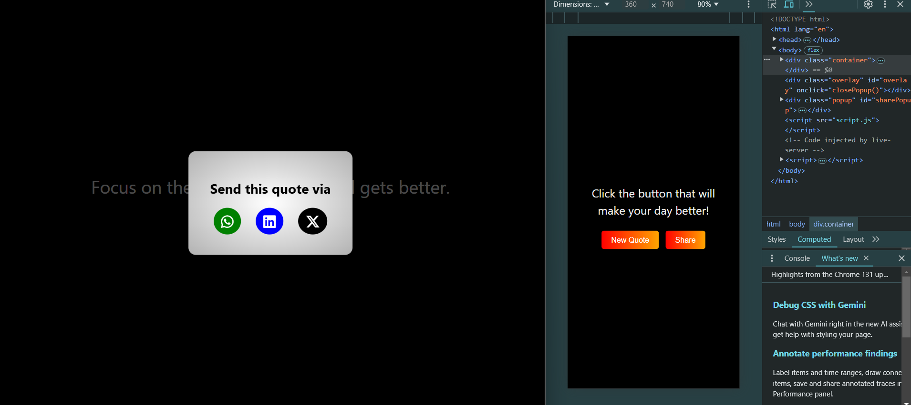

# Daily Quotes App 📜  

A simple web app that generates random daily quotes and allows users to share them on WhatsApp, LinkedIn, and Twitter. It's designed with **HTML**, **CSS**, and **JavaScript** to help brighten your day with motivational and positive quotes.

---

## Features 🚀  

- **Random Quote Generation**: Get a new quote each time you click the "New Quote" button.
- **Share Quotes**: Share the quote via WhatsApp, LinkedIn, or Twitter directly from the app.
- **Responsive Design**: The app is mobile-friendly and works across all screen sizes.

---

## Preview 👀  



---

## How to Use 📋  

1. Clone the repository:  
   ```bash
   git clone https://github.com/Tamilselvan6/DailyQuotes.git
   ```
2. Navigate to the project directory:
   ```bash
   cd DailyQuotes
   ```
3. Open ```index.html``` in your browser to view the app.

4. Click the "New Quote" button to generate a random quote.

5. Click "Share" to open the popup and share the quote via WhatsApp, LinkedIn, or Twitter.

## Technologies Used 🛠️
- HTML: For structuring the web page and displaying the quote.
- CSS: For styling the page and making it responsive.
- JavaScript: For generating random quotes and enabling share functionality.

## Future Enhancements ✨
- Add a feature to customize the quote categories (e.g., motivation, love, life).
- Include a dark mode toggle.
- Improve the share functionality with more platforms like Facebook or email.

## License 📜
This project is open-source and available under the MIT License. Feel free to use, modify, and contribute! 😊

